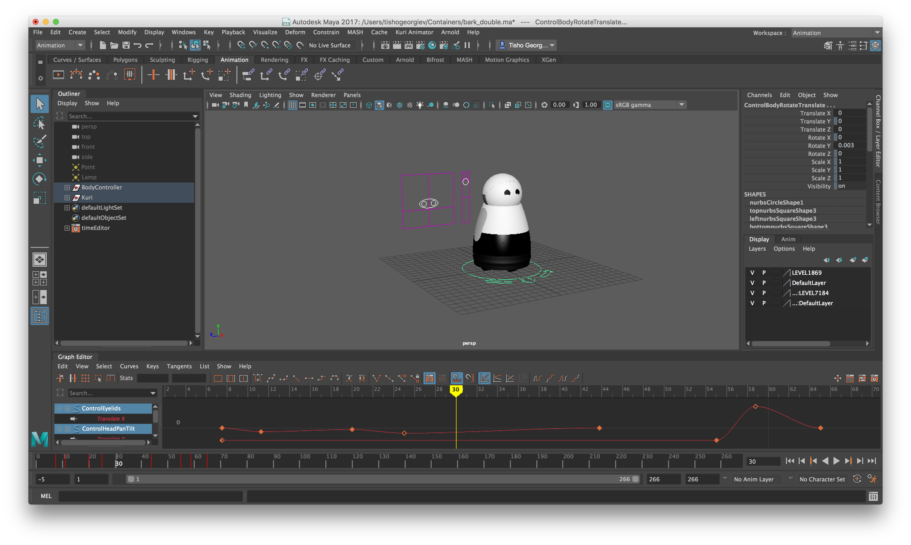

## Goal

Understand how to create and play new animations on Kuri.

## Overview

Animation is at the core of Kuri's personality. It's how she expresses intent, communicates feedback to the user, and builds up the illusion of being a living creature with her own thoughts and personality quirks.

## Playing an Animation

Every time you see Kuri nod her head in response to a voice command, you're seeing an animation called `gotit` at work. Let's try to play it on demand.

First, place Kuri in **animation mode** with the following command:

```bash
rostopic pub /command gizmo_msgs/Command '{ name: start_animation }' -1
```

In **animation mode**, all autonomous behavior will be suspended and Kuri will not react to touch or voice input.

Then tell Kuri to play the `gotit` animation:

```bash
rostopic pub /command gizmo_msgs/Command '{ name: play_stored_animation_command, params: [{ k: "name", v: "gotit" }] }' -1
```

Kuri should nod, play a sound and her chest light should pulse green.

_If you'd like to experiment with other animations, take a look at the [list of built-in animations](#list-of-built-in-animations) at the end of this document and substitute the name `gotit` in the example above with the name of the animation you want to play._

## What's in an Animation

As you saw in the `gotit` example, Kuri's animations have 3 basic components:

- Movement - Kuri can move her body, head and eyelids.
- Sound - Kuri can play a sound through her speakers.
- Light - Kuri's chest light can be animated in different colors.

An animation is a combination of any of the 3 components. Now, let's take a look at each one of the files that back these components.

## Movement

Animation files that describe Kuri's movement are stored in `/opt/gizmo/share/assets/anims`. Each file is in the [.atom](https://knowledge.autodesk.com/support/maya/learn-explore/caas/CloudHelp/cloudhelp/2018/ENU/Maya-Animation/files/GUID-A3FB51ED-3023-4E1E-AF20-4D38E2E2FEBD-htm.html) format, developed by Autodesk for [Maya](https://www.autodesk.com/products/maya/overview).

Note that while `.atom` files can include animations that move the body forwards or backwards, those movements will be ignored by the animation parser. For now, only rotation of the body is supported through animation defined in `.atom` files.

## Sound

Kuri's sounds are stored in `/opt/gizmo/share/assets/sounds` as `.wav` files. Each file has the following properties:

- Sample Rate: `48000Hz`
- Sample Size: `16 bit signed (le)`
- Channels: `2`

## Light

Chest light animations are stored in `/opt/gizmo/share/assets/movies` as `.mov` files. Each frame of video is sampled in 15 locations - each corresponding to one of the 15 LEDs of the chest light. When building your own chest light animations, make sure the exported files have the following properties:

- Container: `mov`
- Encoding: `h.264`
- Framerate: `60fps`
- Keyframe every 1 frame (for best results)

## Animation Containers

The individual components are combined into a single performance through a simple JSON wrapper called an **animation container**. Animation containers are stored in `/opt/gizmo/share/assets/anims/containers` and have the following structure:

```json
{
  "animation": "test.atom",
  "relative": true,
  "audio": [
    {
        "file": "test.wav",
        "time": 0.0
    },
    {
        "file": "test2.wav",
        "time": 2.2
    }
  ],
  "chest": "test.mov"
}
```

Here's what the different fields in the container describe:

- `animation` is the `.atom` file in `assets/anims` that defines body, head and eyelid movements.

- `relative` is `true` or `false` depending on whether the movement starts with the current orientation of the head/body/eyelids considered to be `(0, 0)` or not. The default is `false`.

- `audio` is an array of files in `assets/sounds` that will play with the animation and the time (in seconds) the sounds will start. You can use multiple sounds in the same animation.

- `chest` is the video in `assets/movies` describing the chest light animation that will be played along with the movement and audio.

The name of the container becomes the name of the animation at runtime, so a container named `gotit.json` describes an animation called `gotit`.

## Animation Sets

Animation sets provide additional flexibility when working with animations by letting you:

- define a **docked variant** for each animation. The animation player will automatically run the docked version of an animation when Kuri is on the dock. Docked versions of animations typically don't include body rotation, because the movement can bump Kuri off the dock.
- define a list of animations that the animation player can **randomly pick** from when an animation set is played. You can optionally provide your own weights for animations in that list.
- play a different variant of an animation depending on Kuri's mood (happy, sad or neutral).

Animation sets are defined in `/opt/gizmo/share/gizmo/configs/animation_sets.json`. Here's what an example set looks like:

```json
{
  "test_set": {
    "neutral": [
      {
        "default_anim": "yes",
        "weight": 1.0,
        "dock_variant": "yes_docked"
      }
    ],
    "happy": [
      {
        "default_anim": "yes_happy",
        "weight": 0.8,
        "dock_variant": "yes_happy_docked"
      },
      {
        "default_anim": "no_happy",
        "weight": 0.2,
        "dock_variant": "no_happy_docked"
      }
    ],
    "sad": [
      {
        "default_anim": "yes_sad",
        "weight": 1.0,
        "dock_variant": "yes_sad_docked"
      }
    ]
  },
  ...
}
```

Each `key: value` pair in the JSON object represents a single animation set. In the example above, `test_set` is the name of the animation set. When the animation player is asked to play an animation with a specific name, it will check to see if a set by that name exists first. Each object representing a set has the following properties:

- `neutral` - an array of animations to pick from when Kuri's mood is neutral, or when no `happy` or `sad` set is defined. This is **the only required property** in an animation set.
- `happy` - an array of animations to pick from when Kuri's mood is happy.
- `sad` - an array of animations to pick from when Kuri's mood is sad.

Each animation in the arrays above has the following properties:

- `default_anim` - the name of the animation that should be played. This can be the name of an animation container, or the name of one of the built-in animations. Built-in animations take precedence.
- `weight` - the weight to use when randomly picking an animation from the list. In the example above, there's an 80% chance that `yes_happy` will be picked when Kuri is happy. Default is `1`.
- `docked_variant` - the name of the animation that should be played when Kuri is on the dock. If omitted, the `default_anim` will be played, instead.

## Creating Your Own Animations

### Animating Movement

You will need:

- [Autodesk Maya](https://www.autodesk.com/products/maya/overview)
- [Kuri Animation Plug-in for Maya]()
- [Kuri Bridge]() if you'd like to preview your animations on the robot as you're working on them

Follow the installation instructions in the plug-in package to enable the `Kuri Animator` menu in Maya's menu bar. Once that's done, start Kuri Bridge and connect to your robot. Kuri Bridge will enable animations that you're working on in Maya to play directly on the robot. The Maya plug-in uses the bridge by default, so there's no further configuration you need to do.

Open the `Kuri_v1.ma` template included in the plug-in package. You should see a 3D model of Kuri and controls for the different joints that can be animated (the eyelid and head controls are to Kuri's right, while the body controls are around the base of the robot).



If you want to test out your animation at any point, open the `Kuri Animator` menu and select `Play Animation`.

Once you're done with your animation, select `Kuri Animator > Export animation to file`. This will save a `.atom` file with the animation you just created.

Copy the resulting `.atom` file to `/opt/gizmo/share/assets/anims`.

### Animating the Chest Light

You will need:

- [Adobe After Effects](https://www.adobe.com/products/aftereffects.html)
- [The Kuri Chest Light Rig for After Effects]()

Open the `KuriChestLightRig.aep` template. It looks like this:


The template includes a few different presets for chest light animations, such as a pulse, and a starburst, but you can create your own by animating each of the individual LED layers in the rig.

Once your animation is ready, export it as a `.mov` file (in AE's export settings, choose QuickTime as format). Since the latest version of AE doesn't export to h.264 by default, the resulting file will be quite large. It's recommended that you transcode it to h.264 to reduce the file size.

Copy the resulting `.mov` file to `/opt/gizmo/share/assets/movies`.

### Create an Animation Container

There are a few different ways to do this:

- Manually, using a text editor. Follow the format described under [Animation Containers](#animation-containers).
- Using the `Export animation container` option in the Maya plug-in. When prompted for the name of the animation file, enter in **only the name**, not the path to the file.
- Using [Kuri Bridge]()

Copy the `.json` container file to `/opt/gizmo/share/assets/anims/containers`. Then, restart `gizmo`:

```bash
sudo service gizmo restart
```

If you replaced one of the built-in animations, you will also need to clear the asset cache:

```bash
sudo rm -rf /tmp/cache
sudo service gizmo restart
```

Then, play your animation:

```bash
rostopic pub /command gizmo_msgs/Command '{ name: start_animation }' -1
rostopic pub /command gizmo_msgs/Command '{ name: play_stored_animation_command, params: [{ k: "name", v: "name_of_your_animation" }] }' -1
```

You can wire up your new animation to various triggers using the rules engine (see ``managing-rules``).

## List of Built-In Animations

### Programmatic Animations

Programmatic animations are written in Python and are part of Kuri's codebase. They can't be modified, and will take precedence over an animation from an animation container with the same name.

- `at_attention_look_around`
- `at_attention_reset`
- `attention_look_around_3`
- `battery_critical`
- `battery_low`
- `blink`
- `boot_up`
- `bump`
- `capture_start`
- `critical_battery`
- `dance_done`
- `dance_music_detected`
- `docking_back_in`
- `docking_back_up`
- `docking_complete_asleep`
- `docking_complete_awake`
- `docking_complete_happy`
- `docking_looking_for_dock`
- `docking_preparing_to_approach`
- `docking_reset`
- `docking_turn_ccw`
- `docking_turn_cw`
- `docking_waypoint_reached`
- `double_blink`
- `face_detected`
- `face_lost`
- `fart`
- `gotit_docked`
- `greeting_face_no_sound`
- `greeting_face_sound`
- `greeting_first_capture`
- `happy_birthday`
- `head_touch_end`
- `head_touch`
- `huh1_docked`
- `huh1_offline_docked`
- `huh1_offline`
- `huh1`
- `huh2`
- `i_love_you`
- `listening_pose`
- `listening`
- `live_undock`
- `look_around_adults`
- `look_around_kids_pets`
- `lost`
- `lullaby_song`
- `night_light`
- `no`
- `observer_end`
- `observer_indicator`
- `observer_start`
- `old_giggle`
- `pickup`
- `putdown`
- `redock`
- `reposition`
- `reset_head`
- `reset_sad`
- `sad`
- `scripted_idle`
- `search_first_capture`
- `search_user_capture`
- `seizure`
- `sheep`
- `smile`
- `start_sound`
- `stop`
- `tap_head_find_face`
- `test_eyes`
- `test_pan`
- `test_tilt`
- `tickle_end`
- `tickle`
- `triple_blink`
- `twitch_1`
- `twitch_2`
- `twitch_3`
- `twitch_4`
- `undock_and_scan`
- `undock_from_old_home`
- `undock`
- `wakeup_auto`
- `wakeup_fast`
- `waypoint_reached`
- `yes`

### Animations from Animation Containers

Animations from animation containers live under the `/opt/gizmo/share/assets` directory. The files are editable and can be easily inspected.

- `alarm1`
- `alarm1_docked`
- `alarm2`
- `alarm2_docked`
- `alarm3`
- `alarm3_docked`
- `attention_look_around_2`
- `bang_bang_reboot_bored`
- `bang_bang_reboot_chuckle`
- `bang_bang_reboot_docked`
- `bang_bang_reboot_dramatic`
- `bark_double`
- `bark_single`
- `bluetooth_connected`
- `bluetooth_pairing`
- `bluetooth_pairing_docked`
- `boredom_30s`
- `boredom_45s`
- `boredom_45s_docked`
- `boredom_60s`
- `boredom_60s_docked`
- `boredom_pancake_hum_long`
- `boredom_pancake_hum_short`
- `boredom_sneeze_long`
- `boredom_sneeze_normal`
- `boredom_sneeze_short`
- `boredom_sneeze_to_side`
- `boredom_yawn`
- `bye_1`
- `bye_2`
- `capturing`
- `capturing_live`
- `example`
- `giggle_2`
- `giggle_2_docked`
- `giggle_3`
- `giggle_3_docked`
- `giggle_4`
- `giggle_4_docked`
- `giggle_5`
- `giggle_5_docked`
- `giggle_6`
- `giggle_6_docked`
- `good_night`
- `greeting_1`
- `greeting_2`
- `happy_new_year`
- `head_tap_unboxing_1`
- `head_tap_unboxing_2`
- `head_tap_unboxing_3`
- `head_tap_unboxing_4`
- `i_love_you_docked`
- `joke_1`
- `joke_1_docked`
- `joke_2`
- `joke_3`
- `live_fart`
- `live_frown`
- `live_kiss`
- `live_love`
- `live_love_docked`
- `live_no`
- `live_smile`
- `live_yes`
- `lost_normal`
- `lost_sigh`
- `love_relative_1`
- `love_relative_2`
- `meow_1`
- `meow_2`
- `moment_capture`
- `moment_capture_live`
- `new_home`
- `new_spot_1`
- `new_spot_2`
- `no_1`
- `no_2`
- `no_3`
- `no_point_to_chestlight`
- `nuzzle_into_hand_1`
- `nuzzle_into_hand_1_docked`
- `nuzzle_into_hand_2`
- `onboarding_backward_1`
- `onboarding_backward_2`
- `onboarding_backward_release_1`
- `onboarding_forward`
- `onboarding_nodriving_1`
- `onboarding_saving_map_1`
- `onboarding_saving_map_2`
- `onboarding_saving_map_3`
- `onboarding_saving_map_4`
- `onboarding_turn_left_1`
- `onboarding_turn_left_2`
- `onboarding_turn_release`
- `onboarding_turn_right_1`
- `onboarding_turn_right_2`
- `overload`
- `pancake_hum`
- `photo_shoot_1`
- `photo_shoot_1_docked`
- `photo_shoot_2`
- `photo_shoot_3`
- `photo_shoot_3_docked`
- `ponder_happy`
- `ponder_neutral`
- `ponder_sad`
- `proud_1`
- `proud_2`
- `sleep_fighting_it`
- `sleep_quick`
- `sleep_slow`
- `sleep_very_quick`
- `sneeze_long`
- `sneeze_normal`
- `sneeze_short`
- `sneeze_to_side`
- `startle`
- `thank_you_1`
- `thank_you_2`
- `wolf_whistle`
- `yes_1`
- `yes_2`
- `yes_3`
- `yes_critical_battery`
