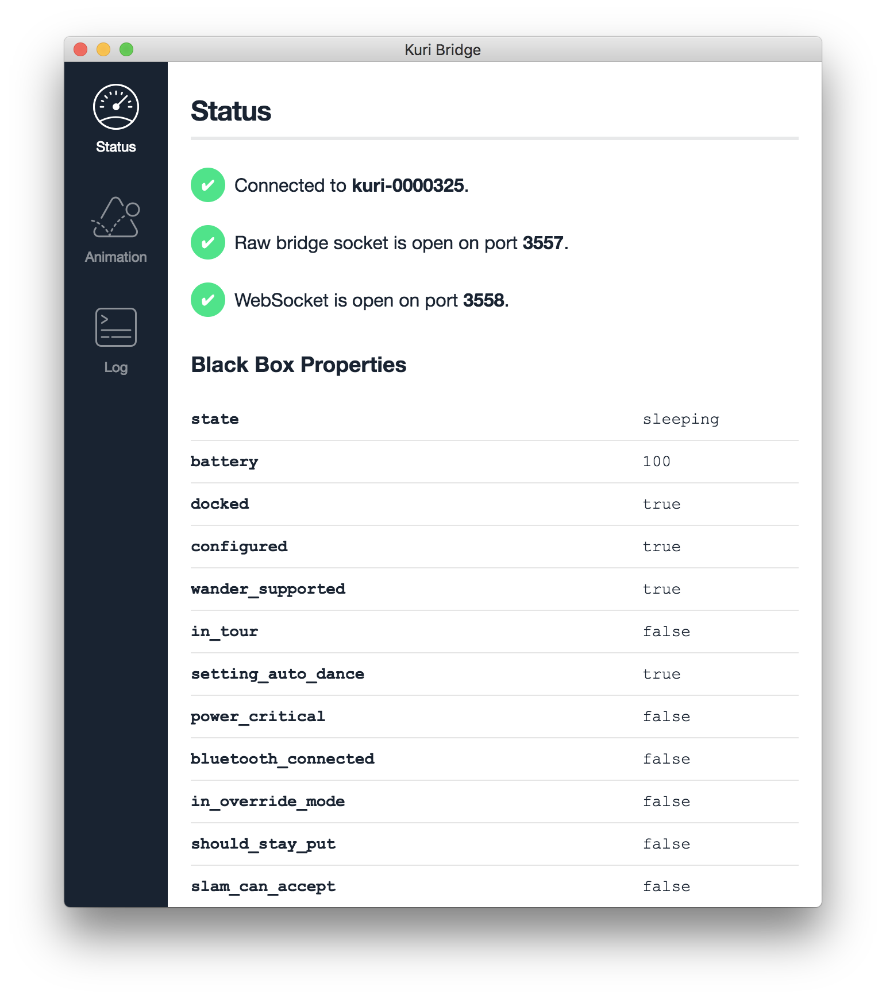
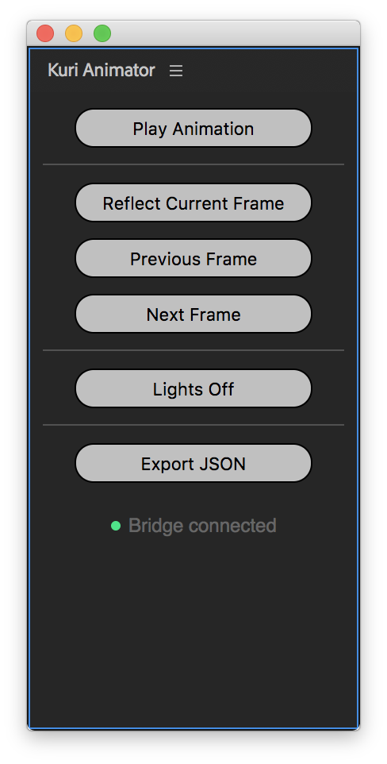

# Kuri Bridge

Kuri Bridge is an app for Mac OS X, Windows and Linux that lets you establish a data channel to your robot without having to worry about complicated setup. All you need is your Kuri account, or if you don't have one - the hostname and id of your robot. After you have a connection, any other app on your computer, including your web browser, can talk to the Bridge to get information or execute commands on Kuri. This means that additional tooling that takes advantage of all the APIs that we've developed for Kuri can easily be developed without worrying about how a connection to the robot can be established.

## Download

- [Download Kuri Bridge for Mac OS X](https://s3-us-west-2.amazonaws.com/kuri-bridge/Kuri+Bridge-0.1.3.dmg) (`.dmg` file)
- [Download Kuri Bridge for Windows](https://s3-us-west-2.amazonaws.com/kuri-bridge/Kuri+Bridge+Setup+0.1.3.exe) (`.exe` file)
- [Download Kuri Bridge for Linux](https://s3-us-west-2.amazonaws.com/kuri-bridge/kuri-bridge_0.1.3_amd64.deb) (`.deb` file)

## Usage

1. Start the Kuri Bridge app
2. Enter in the email and password you used when you first set up your Kuri. If you don't have an account, pick "Using a Direct Connection" from the dropdown and enter in the hostname and the UUID of the robot (see the ``connecting-to-kuri`` guide for details, or take a look at the [FAQ](#faq)).
3. Click "Sign In"

Kuri Bridge will try to establish a connection to your robot. If the connection is successful, you will see a screen that looks like this:

The status screen gives you some useful information about the current value of the properties you can use when putting together your own rules for the robot (see ``managing-rules``), as well as the ports is has opened on your local machine to support communication between the robot and other apps.

### Using the Maya Integration

* [Download the Maya Plug-in](https://s3-us-west-2.amazonaws.com/kuri-bridge/kuri-bridge-maya-plugin.zip)

Follow the instructions in the `README.pdf` to install the plug-in. Once that's done, you should see the "Kuri Animator" menu in Maya's menu bar.

Open the `Kuri_v1.ma` template and choose "Kuri Animator" > "Play animation on Kuri" to try out the animation. The animator plug-in automatically uses the Kuri Bridge connection on your computer. If everything is configured correctly, the animation should just play.

### Using the After Effects Integration

- [Download the After Effects Plug-in](https://s3-us-west-2.amazonaws.com/kuri-bridge/kuri-bridge-aftereffects-plugin.zip)
- Make sure Kuri is running the experimental GBZ with extended animation tooling support.

Follow the instructions in the `README.md` file to install the plug-in. Once it's installed, you should see the "Kuri Animator" extension panel under Window > Extensions. If the Kuri Bridge app is open in the background, you should see a green light next to the text "Bridge connected" at the bottom of the extension panel.

To create new chest light animations, open the `KuriChestLightRig.aep` template in After Effects and make a copy. You will use this file to animate each individual LED. As you're working on the animation, you can check the results of your work directly on the robot using the buttons in the Kuri Animator extension panel.

## FAQ

### How do I find out the hostname of my robot?

The easiest way to do that is by using a mobile device. Since Kuri advertises a Bluetooth audio service, you can look for Kuri under your device's Bluetooth settings. The name that Kuri advertises under will be the hostname of your robot (it will look like `kuri-0000325`). All you need to do is then add `.local` to that name.

### How do I get the UUID of my robot?

Log onto your robot with `ssh` and run: `cat ~/.gizmo/id`. This is the UUID of your robot.
